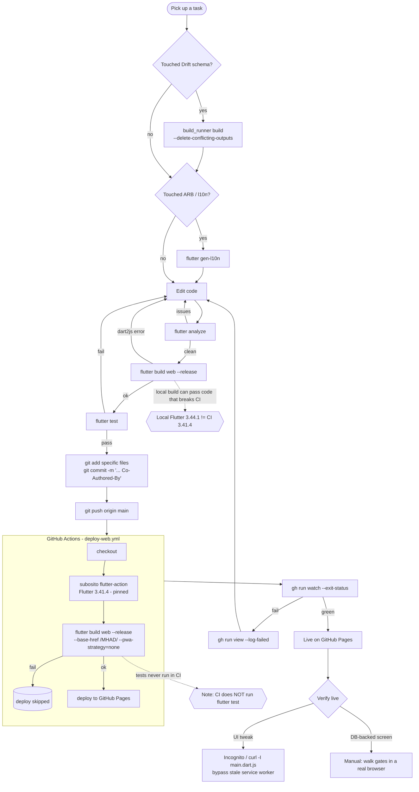

# MHAD — Software Development Workflow

The build/verify/ship loop used in this repo, traced end-to-end, then analyzed
for **dead ends, duplications, and contradictions**. Drawn from the actual
commands used (`D:\flutter\bin\flutter.bat ...`, `gh run watch`), the CI workflow
(`.github/workflows/deploy-web.yml`), and CLAUDE.md.

---

## Findings

### Dead ends
- **D1 (verified) — Tests are a dead end in CI.** `deploy-web.yml` only builds + deploys web; **it never runs `flutter test`**. Local test runs are the *only* enforcement, so tests can silently rot and a broken test never blocks a deploy. *Fix:* add a `flutter test` step (and ideally `flutter analyze`) to CI as a gate before deploy.
- **D2 (verified) — `main` deploys directly; no PR/staging gate.** Push to `main` → immediate production deploy. A bad push is live until the next fix. There's no branch/PR review or preview environment in the loop. *Fix:* protect `main` + deploy from a PR, or add a manual-approval/preview step.
- **D3 (verified) — A red CI run leaves `main` un-deployed but already merged.** If the build fails, the deploy is skipped but the broken commit is on `main`; the site keeps serving the previous build while `main` is broken until fixed-forward. No auto-revert.

### Duplications
- **U1 — The web build runs locally *and* in CI** (`flutter build web --release` both places). Necessary (local catches dart2js before push; CI is the source of truth), but it's the slowest step done twice. Accept as intentional redundancy.
- **U2 — Verification logic is spread across three checks** that overlap: `analyze`, local `build web`, and CI `build web`. `analyze` is a strict subset of what the build catches for compile errors — its unique value is lints/style, not compile safety.
- **U3 — Two codegen triggers** (`build_runner` for Drift, `gen-l10n` for ARB) are easy to forget and aren't enforced anywhere; a missed regen surfaces only as a build/analyze error later. *Fix:* a pre-commit/CI check that generated files are up to date.

### Contradictions / traps
- **C1 (verified) — "Local green" contradicts "CI green."** Local toolchain is **Flutter 3.44.1**, CI is pinned **3.41.4** (`local-flutter-version-skew`). Local `analyze`/`build` can pass code that uses 3.44-only APIs and **breaks the CI dart2js build** (real burn: `SizeTransition.alignment`). So a clean local run is *not* proof CI passes — you must watch CI every push. This is the workflow's sharpest trap.
- **C2 (verified) — "analyze passed" ≠ "web compiles."** `flutter analyze` can be clean while dart2js fails (e.g., a missing `kIsWeb` import). The mitigation (`web-build-dart2js-vs-analyze`) is to always run the real `build web` before claiming web-safe — i.e., analyze alone is misleading.
- **C3 (verified) — "Deploy succeeded" ≠ "user sees it."** A stale Flutter **service worker** served old builds for ~2 sessions despite green deploys (`web-deploy-stale-service-worker`). Now SW is disabled (`--pwa-strategy=none`); verify via `curl -I` Last-Modified + Incognito, never a plain refresh. So "CI green" and "looks live" can still disagree.
- **C4 (process) — The quality bar lives in habit, not in the pipeline.** analyze + test + web-build are disciplined *conventions*, but nothing in CI enforces analyze or tests. The contradiction: the project treats these as required, yet the automation treats only the web build as required.

### Recommended hardening (cheap → higher effort)
1. Add `flutter analyze` + `flutter test` steps to `deploy-web.yml` **before** the build/deploy (closes D1, U2, C4).
2. Add a "generated files up to date" check (`build_runner`/`gen-l10n` no-op) to CI (closes U3).
3. Pin the *local* dev instructions to 3.41.4 or add a CI matrix note; at minimum keep watching CI per push (mitigates C1).
4. Consider deploying from a PR with a preview build instead of straight-to-`main` (closes D2/D3).
