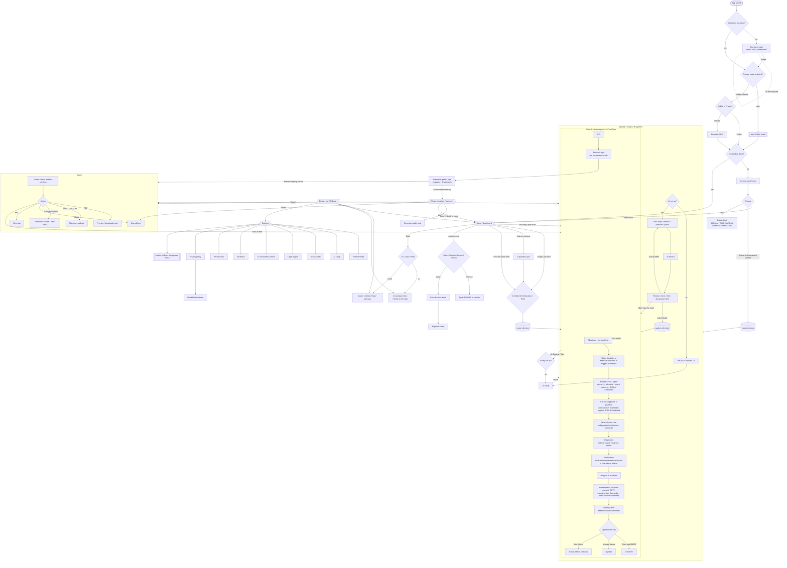

# MHAD — User-Facing Decision Flow (web focus)

A trace of **every user-facing decision point** from launch to finish, built from
the router gates (`lib/ui/router.dart`) and the navigation edges across `lib/ui/`.
Below the diagram: **dead ends, duplications, and contradictions** found.
Items marked **(verified)** were confirmed in code; **(candidate)** need a closer
look.

> Rendered as Mermaid — view on GitHub or any Mermaid viewer.

---

## Resolution status (2026-06-15)

All findings below were addressed. Summary:

| ID | Status | Resolution |
|----|--------|-----------|
| D1 | ✅ Fixed | "Done — back to home" added to the summary (`wizard_complete_screen.dart`, `go` resets the stack) |
| D2 | ✓ By design | Gate already makes acceptance explicit (disabled CTA + ack wording); forced-accept is correct for a legal gate |
| D3 | ✅ Mitigated | Web `beforeunload` unsaved-work guard while the wizard is open (`utils/unsaved_guard*`); full fix is the parked portable-file work |
| D4 | ✓ Verified | Settings hides directive actions with no directive (`_CurrentDirectiveSection` → `shrink()`); add-ons live in the wizard — no dead-end |
| U1/U4/U5 | ✓ Intentional | Many entry points to export/AI-setup/education/crisis are deliberate convenience/safety redundancy |
| U2 | ✓ Verified | Form-type quiz + cards both route through the same `_start` — can't disagree |
| U3 | ✅ Fixed | Sidebar door relabeled "Autofill from a document" (distinct from the planned "Continue from a saved file") |
| C1 | ✅ Fixed | Onboarding "Stays on your device" → "Nothing is saved" on web (`kIsWeb`); privacy policy already Public/Private-mode-aware |
| C2/C3 | ✓ Verified | Post-sign uses `go` for forward progress, `push` for side-trips; stack depth ~2 — no deep-stack issue |
| C4 | ⏳ In build | "Two editors" is handled by the pipeline reconciliation work (diff-against-existing + guaranteed final review) |

Detailed analysis (as originally found) below.

---

## Findings

### Dead ends
- **D1 (verified) — Wizard-complete "summary" has no explicit *Done → Home* CTA.** It offers Share / Export / Wallet only (`wizard_complete_screen.dart:235-303`); the user leaves via the global nav or device back. On the pushed route with no bottom-nav context this can feel terminal. *Fix:* add a clear "Done" / "Back to home" action.
- **D2 (verified, by-design) — Disclaimer gate has no decline/exit.** `router.dart` forces `/disclaimer` until accepted; on web there's no app to exit to. Acceptable for a legal gate, but it's a no-alternative decision worth stating explicitly ("you must accept to use the app").
- **D3 (verified, web) — Reloading `/wizard/:id` or `/upload/:id` on web orphans the in-memory directive.** No persistence on web (see standalone-snapfill note) → a refresh mid-flow silently loses work. This is the exact gap the portable-file work is meant to close.
- **D4 (candidate) — Add-on / settings-reached sub-screens may dead-end without a directive.** `side-effects`, `ulysses`, `crisis-plan`, `ai-check` take a `:directiveId`. Reached from the wizard they're fine; if reached from Settings → "My directive" against a missing/empty directive, confirm they don't land on an empty/stuck state.

### Duplications
- **U1 — Export is reachable from 6 places** (execution, wizard-complete, home, sidebar, past-detail, wizard back). Convenient, but it means "what happens after I sign?" has several overlapping doors.
- **U2 — Form-type decision exists in two UIs:** the home `DirectiveFormChoice` cards **and** the `form_type_quiz`. Same decision, two surfaces — ensure the quiz result and the cards can't leave the app in conflicting form-type state.
- **U3 — Two (soon three) "bring your info" doors:** onboarding "Upload a document to autofill" and the sidebar "Upload to autofill" both → `/upload`; the planned "Continue from a saved file" adds a third. This is the IA-confusion risk already flagged — they must be labeled distinctly.
- **U4 — AI-setup reachable from 6 places** and **Education from 6 places** (assistant, settings, side-effects, pipeline, ai-suggest, sidebar / home, web-landing, wizard-help, bottom-nav). Expected for utility destinations; listed for completeness.
- **U5 — Crisis access is duplicated across 5 surfaces** (disclaimer pill, onboarding pill, crisis top-bar, sidebar card, in-sheet). Intentional safety redundancy — keep, but it *is* duplication.

### Contradictions / smells
- **C1 (verified-OK, watch) — Web forces Public mode** (`router.dart` auto-`setPublicMode` on web) while the app's value language leans on "Private / on-device." Settings correctly gates private-only sections by `isPrivate`/platform, so there's no *navigational* contradiction — but the **copy** must never imply private storage on web (governed by the legal-wording-canon). Keep auditing copy.
- **C2 (verified, minor) — Post-sign has two "next" affordances:** "Preview signing packet" (→ Export) and "Continue to summary" (→ Complete). Not contradictory (distinct intents), but a user can ping-pong Export ⇄ Complete ⇄ Export via push, deepening the back-stack.
- **C3 (candidate) — Push-stack depth after signing.** Execution → (push) Export, and Complete → (push) Export/Share. Reaching Export from Complete which was reached from Execution stacks three pushed routes; "back" then walks back through them. Consider `go` (replace) instead of `push` for the post-sign hub.
- **C4 (active build) — Two editors for the same fields:** the new pipeline reconciliation and the wizard both write the same directive fields. The reconciliation must diff against current state (not blind-write) and the guaranteed final wizard review must reflect pipeline-applied values — exactly the model being built.
